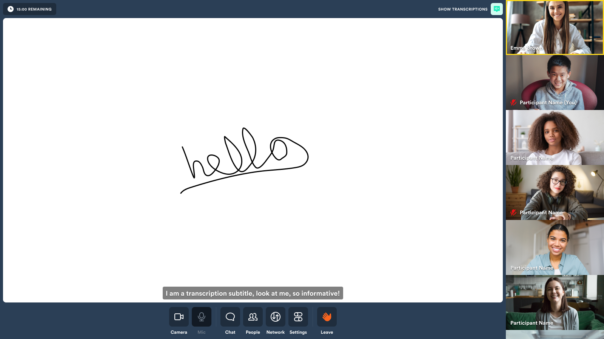

# Virtual class demo



### Live example

**[See it in action here ➡️](https://virtual-class-demo-daily.vercel.app/)**

---

## What does this demo do?

- Built on [NextJS](https://nextjs.org/)
- Create a Daily instance using call object mode
- Manage user media devices
- Render UI based on the call state
- Handle media and call errors
- Obtain call access token via Daily REST API
- Handle pre-authentication, knock for access and auto-join
- This demo has two participant types:
  - Teachers, who can:
    - Can screen share
    - start whiteboard
    - allow students to talk
  - participants, who can:
    - join the call
    - view the whiteboard

Please note: this demo is not currently mobile optimised

### Setting up transcription

For testing the transcription service, you will have to register for a
Deepgram API key and configure your Daily domain with that key. Get instructions
under `enable_transcription` in our [domain configuration](https://docs.daily.co/reference/rest-api/your-domain/config#enable_transcription) documentation.

### Getting started

```
# set both DAILY_API_KEY and DAILY_DOMAIN
mv env.example .env.local

# from project root...
yarn
yarn dev
```

## How does this example work?

This demo puts to work the following [shared libraries](shared):

**[MediaDeviceProvider.js](contexts/MediaDeviceProvider.js)**
Convenience context that provides an interface to media devices throughout app

**[useDevices.js](../../shared/contexts/useDevices.js)**
Hook for managing the enumeration and status of client media devices

**[CallProvider.js](contexts/CallProvider.js)**
Primary call context that manages Daily call state, participant state and call object interaction

**[useCallMachine.js](contexts/useCallMachine.js)**
Abstraction hook that manages Daily call state and error handling

**[ParticipantsProvider.js](contexts/ParticipantsProvider.js)**
Manages participant state and abstracts common selectors / derived data

## Deploy your own on Vercel

[](https://vercel.com/new/clone-flow?repository-url=https://github.com/daily-demos/virtual-class-demo.git&env=DAILY_DOMAIN,DAILY_API_KEY)
